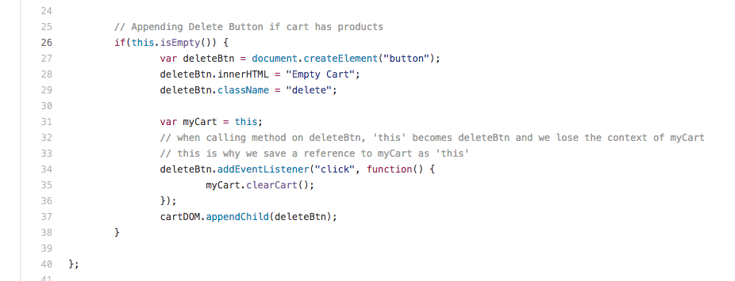

##### Sometimes, we lose our this reference. When that happens, we end up using confusing hacks to save our reference to this.

##### So why did I need to save a this reference? Because inside deleteBtn.addEventListener, this refers to the deleteBtn object. This is unfortunate. Is there a better solution?

- [BIND](Bind.md)

* [CALL, APPLY](Call.md)
