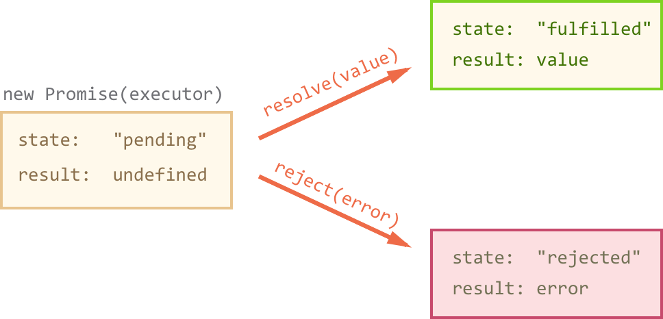

### Promises in JavaScript are a way to handle async calls. Before Promises were introduced in JavaScript ES6, async calls in JavaScript were handled using callback functions. Promises provide a cleaner, more elegant syntax and methodology to handle async calls.

##### The resulting promise object has internal properties:

- state — initially “pending”, then changes to either “fulfilled” or “rejected”,

* result — an arbitrary value of your choosing, initially undefined.

##### When the executor finishes the job, it should call one of the functions that it gets as arguments:

- resolve(value) — to indicate that the job finished successfully:
  ⋅⋅\* sets state to "fulfilled",
  ⋅⋅\* sets result to value.

- reject(error) — to indicate that an error occurred:
  ⋅⋅\* sets state to "rejected",
  ⋅⋅\* sets result to error.



##### A Promise consists of two parts:

- The first part creates the Promise and defines the conditions of what is considered successful and not successful.

- The second part describes what to do when the successful condition is met with the resolve() function definition, and what to do when the not successful condition is met with the reject() function definition.

```javascript
let promise = new Promise(function(resolve, reject) {
  setTimeout(() => resolve('done!'), 1000);
});

// resolve runs the first function in .then
promise.then(
  result => alert(result), // shows "done!" after 1 second
  error => alert(error), // doesn't run
);
```

##### Usage

```javascript
function loadScript(src) {
  return new Promise(function(resolve, reject) {
    let script = document.createElement('script');
    script.src = src;

    script.onload = () => resolve(script);
    script.onerror = () => reject(new Error('Script load error: ' + src));

    document.head.append(script);
  });
}

let promise = loadScript(
  'https://cdnjs.cloudflare.com/ajax/libs/lodash.js/3.2.0/lodash.js',
);

promise.then(
  script => alert(`${script.src} is loaded!`),
  error => alert(`Error: ${error.message}`),
);

promise.then(script => alert('One more handler to do something else!'));
```

```javascript
// PROMISE
/* Every Promise() structure has 2 parts */
//First Part
/* Create the Promise() and define the conditions of what is considered successful and not successful.*/
let promise1 = new Promise((resolve, reject) => {
  let dataReceivedSuccessfully = false;
  /* This is an arbitrary variable and is NOT part of the Promise */
  if (dataReceivedSuccessfully)
    //This condition is considered successful, hence invoke resolve()
    resolve('Data Available!');
  if (!dataReceivedSuccessfully)
    //This condition is considered NOT successful, hence invoke reject()
    reject('Data Corrupted!');
});
//Second Part
/* Define what to do when the successful condition(i.e. resolve()) is / met, and what to do when the not successful condition(i.e./ reject()) is met. */
promise1
  .then(message => {
    console.log(message);
    /* define the resolve() function, 
/ in other words, what to do when the promise is successful. */
  })
  .catch(message => {
    console.log(message);
    /* define the reject() function, 
/ in other words, what to do when the promise is NOT successful.*/
  });
```

##### The Promise()object is a built-in object in JavaScript ES6. When this object is instantiated using the new keyword, it takes a function as an argument. This single function in turn takes two arguments, each of which are also functions — resolve and reject. So keep in mind that the (resolve, reject) arguments in Promises are actually callback functions.

(https://javascript.info/promise-basics)
